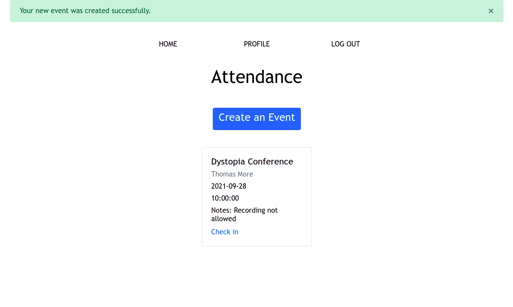

# Attendance Keeper

## Purpose

This minimalist event management app simplifies event sign-up for both users and hosts. Attendees can check in to events without registering as site users, keeping the effort minimal for guests. Only on-going and upcoming events are presented to site visitors, minimizing the potential for confusion about which event to join and, by extension, the creation of bad data. Hosts can log in using Google and then, behind login-protected routes, secure events with passkeys, view attendance percentages of repeat guests, add and remove attendees, and delete events.        

## Technologies

This Python project is on a Flask framework with database support via Psycopg2 and SQLAlchemy. Flask-WTF handles and secures the forms, and Flask Werkzeug encrypts user passwords. The Datetime library is employed to convert event date and time data for display and check-in filtering. The Oauth2 library and Requests are used to enable third-party logging through Google, and the requisite Client ID and Secret variables are accessed as environment variables for enhanced security. On the front end, Flask Flash messages update users and hosts about authorization and form submission events. Jinja2 templates support a dynamic nav and efficient site design, while Bootstrap4 columns, rows, and cards keep information streamlined and orderly.

## App Images

The user scrolls through Bootstrap4 cards to select an event. A link on each card takes the user to a check-in form.

Hosts can log in with unique credentials or use a third-party option from Google.

Each event's unique page lists all participants. Links allow hosts to remove participants and view attendance data.

A host's profile displays all events ever created by that host and features links to routes allowing for adding of participants and editing/deleting of events, as well as more detailed information about attendees.

## License

Creative Commons BY-SA 4.0

## Db regeneration process notes

Locally:
`export FLASK_APP='attendance'`
`flask db init`
`flask db migrate`
commit changes and push to main
on Heroku: copy and paste deploy db url env var to deploy db url. Then open console and run `flask db upgrade`
